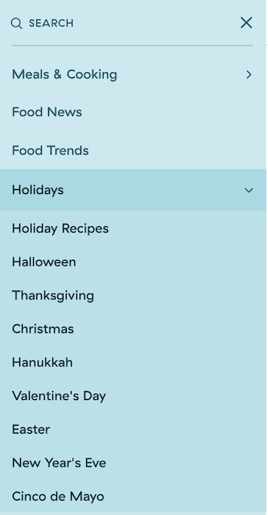

# DH150: Assignment 01 Heuristic Evaluation by GeeYun Chae

### Cooking Recipes
As the theme of the project was "middle-aged women's happiness", what first came up on my mind was cooking website or app.
During this unpleasant time, where outdoor eating is not allowed or flavorable, people often eat from home and cook for themselves.
It might be very stressful having to cook every single day either for myself and family members. 
However, now there are different cooking websites or app that can actually make cooking fun and easy. During the research,
I was able to find two resources: a website that introduces recipes and food trends, and an app that helps to do grocery shopping for you.
By enhancing the UX design, both resources can be more approachable to people of different age whether they are tech-friedndly or not.

### Severity Scale for Usability Problems
Ratings from 1~3 are used to examine the usability problems.
|Rating|Importance|
|----|-----|
|1|Cosmetic Problem.
|2|Minor Usability problem; low priority
|3|Major usability problem, important to fix; top priority|

### Heurisic Evaluation of Website - *Delish*
https://www.delish.com/
Delish is a website that provides variety of food recipes and food trends. All the dishes are provided with a video insturction of how to make them. 
Underneath the video, there are 3 section that provides the user the yields, prep time, and total time. On the upper left-hand side of the webpage, there
is a button that will lead the user to the search bar, and website categories. In the navigation bar there are 15 items: 
Meals & Cooking, Food News, Food Trends,Holidays, Kitechen Tips and Tools, Restauratns & Chefs, Entertaining & Parties, Delsih Shop, Shop Delish Essentials,
Shop Delish Ice Crea, All Videos, Newsletter, About Us, Follow, Bite Club.

### 1: Visibility of System Status
|Rating|Evaluation|
|-----|-----|
|3| As a user click on the website, the first thing that pops up is a large banner of the food. It makes the user scroll down to access to subscription or log in button. The "Log-in" and "Subscription" button does not change color when the user clicks on it. It might be very confusing for the user to know whether they are logged in or not. |
|3| As a user clicks on the search button, it automatically leads the user in to a new black-blank page. After, user types in a word, it leads the page back in to the normal format. This can be a little time consuming and it might confuse the user when they have to search in a word. It will be better and easier to allow the user to seach up the word in the search naviagtion bar, rather than reconnecting them to a new page with different web format. |
|3| The navigation tab of "all video" leads the user to another designed-formatted webpage which shows a youtube video. Underneath, there is a line of "Featured videos from Delish". It makes it very difficult for the user to search through specific video that a user is looking for. 

### 2: Match Between the System and the Real World
|Rating|Evaluation|
|----|----|
|2| On the first page of the website, there are sections that catches attention in big bold letters. The captions can be seen as fun and trendy, but it might confuse the users of the things that they are seeing. It will be better to actually categorize the caption with more direct words such as "Halloween: Pumpkin recipes". It will be more straight forward.|
|3| It will be easier to look through the navigation bar when the categories are more organized. Since there are cateory of "Meals & Cooking" and "Holidays", it might confuse the user and make it not effecient. It will be more eaier to be understood if the "Holiday" was in the subcategory of "Meals & Cooking", because it is a category of recipe. |

 

### 3: User Control and Freedom
|Rating|Evaluation|
|----|----|
|3|The "x" button on the naviagtion bar is the only buttton that allows the user to hide the naviagtion bar or to see the main menu. There is no undo or back to the search button in this website. It would have been better for the website to provide an option to navigate back to the options that they were looking at before they accidentally clicked on something.|
|3| When a user clicks on the subscription button, it automatically leads the user in to a new page where they can insert their email address for subscription. However, there is no exit or undo button and the user solely needs to rely on the go and back button provided on the tool bar of their internet page. There should be a little exit button, or make the subscription page a pop-up instead of a redircting to a new page.|

### 4: Consistency and Standard
|Rating|Evaluation|
|----|----|
|3| The website also allows the user to make purchase of the recipe's ingredients from different food distributors. However, there isn't any shopping cart option where is allows the user to see their saved items. Also, in the navigation bar, the items "Delish Shop" automatically redirects the user in to another shopping website. This can be found very ineffective and might diminsh the user-friendly design.|
|3| On the upper right hand side of the webpage, where the other webpages follows the external format of placing a shopping cart, account button, saved preferences, this webpage just lines up a button of "subscription" and "account". It will be more familiar to the users to provide icons on the top upper right hand corner for conveninece.

### 5: Error Prevention
|Rating| Evaluation|
|---|---|
|3| It would be very helpful to have a typo indicator in the search bar, because people might make mistakes on spellings of certain foods. It will lead to more satisfying and accurate searches.
|3| When a user searches for a specific words, the results are all clustered in a junk of information. It will be better to provide an option to pick the category when searching for a word. It will lead to more accurate search results and will be less time consuming.
|3| There should be a help page in the website. 

### 6: Recognition Rather Than Recall
|Rating| Evaluation|
|2| Upon searching and looking for a specific recipe, it will be helpful to provide related recipes that might create a better meal idea for the user.|
|3| When searching for a word, it will be more easier for the user to see the possible options throught the drop down list.
|3| A saved or like buttton can be helpful to collect the information of user interest. There isn't any function on the web that allows the user the view what they've been looking or searching for. |

### 7: Flexibility and Efficiency of Use
|Rating|Evaluation|
|----|----|
|3| It will be helpful to provide the user with save button to save the recipe for later use. However, the website only provides the option to view the picture in pinterest, emailing, and printing. Instead of having to send over the recipe from web to email, it will be more effecient to view saved recipes from the web.
|3| The website overall is mixed of information, articles, recipes. It will create confusion for the user. It will be better to have categorical or advanced search options to narrow down the search and options.

### 8: Aesthetic and Minimalistic Design
|Rating|Evaluation|
|----|----|
|3| Too complicated definitions of the categories in the navigation bar. It should be narrowed down.
|3| Lack of usage of familiar icons. All the buttons are consists of words. It will create more simple and clean look throughout the webpage when symbols are used instead of words.
|3| There are too many banners and ads which makes the design far from clean.
|3| The text size on the home page is not aligned. It is essential to organize the captions with size.
|3| The sizes of video is too large. On the home page, it will be better to make them a preview size rather than the size given. 

### 9: Help Users Recognize, Diagnose, and Recover from Errors
|Rating|Evaluation|
|----|----|
|3| There is no "not found" or "Error" function in the search option. Even though a wrong word is typed, there would be number of results. This would not only make the users think that the search is inaccurate, but also will not be helpful to correct the errors that they've made. The website fails to precisely indicate the error or problem.|

### 10: Help and Documentation
|Rating| Evaluation|
|----|----|
|3| It is not easy to search for help in the website. It lacks the Help page or any other customer service. The only way it provides help would be to send an email to info@delish.com|
|3| The site map does not help at all. It just lists all the categories in the naviagtion bar rather than an explanation of the site. |
|3| There can be a function that allows the user to search for help easily with "top article suggestions" or "relevant search options".|
|3| The website provides too much unnecessary information during the process of search. The options should be strictly narrowed down with relevant answers or posts. |

## Heuristic Evaluation on App - *Mealime*
https://www.mealime.com/
Mealime is an app that allows the user to search for new recipes. The app provides the information of the cookware, ingredients, and instructions with details. It allows the user to select on the grocery check list which will list all the ingredients. There is also an option for delivery and pick up from different locations of preferences. 

### 1: Visibility of System Status
|Rating|Evaluation|
|----|----|
|0| This app allows the user to track all the actions that they take. It will allow the user to check the items of their interests and to save it up for later view. It also allows the user to have list of options when they search. It provides convenience and ensures accuracy.|

### 2: Match Between System and the Real World
|Rating|Evaluation|
|----|----|
|1| This app works just like a physical cook book. The instructions are listed with careful and specific measurements. However, it will be more effecient if somekind of picture or video of cooking procedure are provided. |

### 3: User Control and Freedom
|Rating|Evaluation|
|----|----|
|1| The app allows the user to click on the finished meal from the meal plan on the site. However, you'll need to tap on the setting button on the right hand corner in order to actually delete the one that you've accidentally added. It will be more efficient to add a function to slide to delete.|

### 4: Consistency and Standards
|Rating|Evaluation|
|----|----|
|2| It will be more easier to lock the icon bar at the bottom of the app throughout the navigation. When searching for meal, the tool disappers and you have to press on the exit button to see your preference. |

### 5: Error Prevention
|Rating|Evaluation|
|----|----|
|1| It would have been helpful when there are typo indicator or relevant options in this app. It a typo is made, it will just lead on the no matching recipes page.|
|2| Most of the recipes are "pro-only". When a user presses on to one of the following, a pop up will be alerting that this recipe is only for pro and requires a paid upgrade. It will be more efficent if paid and free vesions are categorized for easier search.|

### 6: Recognition Rather than Recall
|Rating|Evaluation|
|----|----|
|3| It would be very helpful to provide or list relevant search options from the past interest of the users. This app allows you to save the recipes, but does not recommend according to the user's interest. The categories are mostly listed by: recently created, most popular, top rated, etc.|

### 7: Flexibility and Efficiency of Use
|Rating|Evaluation|
|----|----|
|3| It is very important for an app to have accelerators in their system. This app is conveninent, but does not perform any function of accelerators. Double-tap to like or save; Slide to delete a meal plan or recipe might be useful.|

### 8: Aesthetic and Minimalistic Design
|Rating|Evaluation|
|----|----|
|0| All the fonts size and font style aligns. It gives a clean overall look.|
|2| On the first page of build a meal plan, it might have been more easier for the user to show the categories of the meals, rather than listing all kinds of meal by the recently added order. |
|2| Icons of different categories (pasta, meat, etc.) would have been made the app look more clean and minimalistic rather than showing all the food pictures at once. |

### 9: Help Users Recognize, Diagnose, and Recover from Errors
|Rating|Evaluation|
|----|----|
|2| There should be recommendations, relevant search options for the user based on their search history and preferences.|

### 10: Help and Documentation
|Rating|Evaluation|
|----|----|
|2| There are support page and F&Q pages with list of questions. However, the information descriptions are very long and oveloaded that it is not very easy to look for the information. A virtual service button or service navigation steps can be provided for easier assistant when needed.|
|0|The contact us service is very well organized. It allows easy approach to the service center. |

